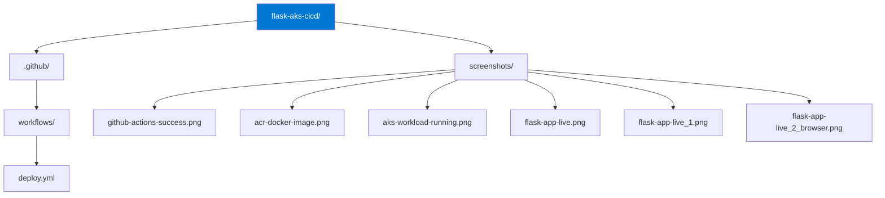

Got it. The README already has a Pipeline Screenshots section with all six images. The image syntax needs fixing though - they're showing as plain text links instead of rendered images. Here is the full corrected README:

CI/CD Pipeline - Flask App Deployment on Azure Kubernetes Service (AKS)

Overview

This repository contains the CI/CD pipeline implementation for the Flask App Deployment on Azure Kubernetes Service (AKS) project. The pipeline automates the build, push, and deployment process using GitHub Actions, eliminating manual steps and ensuring every push to main delivers a fresh deployment to AKS.

Original Project

This pipeline extends the original Flask AKS deployment project, which covers:
- Infrastructure provisioning with Terraform
- Docker containerization and ACR image management
- Kubernetes deployment with rolling updates
- Real-world troubleshooting of pod failures and image pull errors

View the original project here: Flask-App-Deployment-on-Azure-Kubernetes-Service-AKS (https://github.com/maxmagnac/Flask-App-Deployment-on-Azure-Kubernetes-Service-AKS-)

Technologies Used

- Python / Flask
- Docker
- Azure Container Registry (ACR)
- Azure Kubernetes Service (AKS)
- GitHub Actions
- Azure CLI

Azure Resources

| Resource | Name |
|---|---|
| Resource Group | flask-aks-rg |
| AKS Cluster | flask-aks-cluster |
| Container Registry | flaskaksacr2026 |

Repository Structure



How the Pipeline Works

Every push to the main branch triggers the GitHub Actions workflow automatically. The pipeline runs the following steps in sequence:

1. Checks out the repository
2. Logs into Azure using GitHub Secrets
3. Builds the Docker image
4. Pushes the image to Azure Container Registry
5. Updates the AKS deployment with the new image

GitHub Secrets Required

| Secret | Description |
|---|---|
| AZURE_CREDENTIALS | Azure service principal credentials |
| ACR_NAME | Azure Container Registry name |
| AKS_CLUSTER_NAME | AKS cluster name |
| AKS_RESOURCE_GROUP | Azure resource group name |

Pipeline Screenshots

```

GitHub Actions - Successful Pipeline Run
GitHub Actions Success (screenshots/github-actions-success.png)
```


Azure Container Registry - Docker Image Stored
ACR Docker Image (screenshots/acr-docker-image.png)

AKS Workload - Flask App Pods Running
AKS Workload Running (screenshots/aks-workload-running.png)

Live Flask App - Azure Portal Services View
Flask App Live (screenshots/flask-app-live.png)

Live Flask App - kubectl Service Output
Flask App Live CMD (screenshots/flask-app-live_1.png)

Live Flask App - Browser Confirmation
Flask App Live Browser (screenshots/flask-app-live_2_browser.png)

Skills Demonstrated

- CI/CD pipeline design and automation with GitHub Actions
- Azure service principal authentication and GitHub Secrets management
- Docker image build and push automation
- Kubernetes rolling deployment automation
- End-to-end cloud-native delivery pipeline on AKS

Maurrin Carter | Cloud Engineer | Azure | Kubernetes | Docker | GitHub Actions
