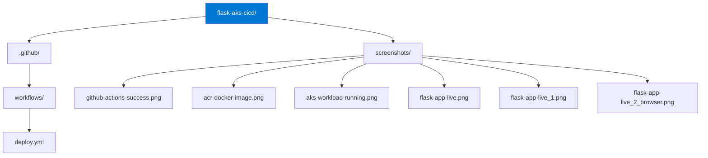

Got it. The README already has a Pipeline Screenshots section with all six images. The image syntax needs fixing though - they're showing as plain text links instead of rendered images. Here is the full corrected README:

CI/CD Pipeline - Flask App Deployment on Azure Kubernetes Service (AKS)

Overview

This repository contains the CI/CD pipeline implementation for the Flask App Deployment on Azure Kubernetes Service (AKS) project. The pipeline automates the build, push, and deployment process using GitHub Actions, eliminating manual steps and ensuring every push to main delivers a fresh deployment to AKS.

Original Project

This pipeline extends the original Flask AKS deployment project, which covers:
- Infrastructure provisioning with Terraform
- Docker containerization and ACR image management
- Kubernetes deployment with rolling updates
- Real-world troubleshooting of pod failures and image pull errors

View the original project here: Flask-App-Deployment-on-Azure-Kubernetes-Service-AKS (https://github.com/maxmagnac/Flask-App-Deployment-on-Azure-Kubernetes-Service-AKS-)

Technologies Used

- Python / Flask
- Docker
- Azure Container Registry (ACR)
- Azure Kubernetes Service (AKS)
- GitHub Actions
- Azure CLI

Azure Resources

| Resource | Name |
|---|---|
| Resource Group | flask-aks-rg |
| AKS Cluster | flask-aks-cluster |
| Container Registry | flaskaksacr2026 |

Repository Structure

How the Pipeline Works

Every push to the main branch triggers the GitHub Actions workflow automatically. The pipeline runs the following steps in sequence:

1. Checks out the repository
2. Logs into Azure using GitHub Secrets
3. Builds the Docker image
4. Pushes the image to Azure Container Registry
5. Updates the AKS deployment with the new image

GitHub Secrets Required

| Secret | Description |
|---|---|
| AZURE_CREDENTIALS | Azure service principal credentials |
| ACR_NAME | Azure Container Registry name |
| AKS_CLUSTER_NAME | AKS cluster name |
| AKS_RESOURCE_GROUP | Azure resource group name |

Pipeline Screenshots

GitHub Actions - Successful Pipeline Run

GitHub Actions Success

Azure Container Registry - Docker Image Stored

AKS Workload - Flask App Pods Running

Live Flask App - Azure Portal Services View

Live Flask App - kubectl Service Output

Live Flask App - Browser Confirmation

Lessons Learned

Azure Credentials Configuration
Configuring the AZURE_CREDENTIALS secret required generating a service principal with the correct role assignments. The JSON output from the az ad sp create-for-rbac command maps directly to the GitHub secret - formatting errors in that JSON block caused initial authentication failures. Validating the JSON structure before saving it as a secret resolved the issue.

YAML Syntax in GitHub Actions
GitHub Actions workflows are strict about indentation and spacing. A single misaligned step or missing colon caused the entire pipeline to fail at parse time. Reading the error output in the Actions tab carefully and validating the YAML with a linter before pushing saved significant troubleshooting time.

AKS Deployment Timing
After pushing a new image to ACR, the AKS deployment update requires a moment to pull and spin up the new pod. Building a clear understanding of rolling update behavior - and using kubectl get pods to monitor pod status - helped confirm successful deployments.

Skills Demonstrated

- CI/CD pipeline design and automation with GitHub Actions
- Azure service principal authentication and GitHub Secrets management
- Docker image build and push automation
- Kubernetes rolling deployment automation
- End-to-end cloud-native delivery pipeline on AKS

Maurrin Carter | Cloud Engineer | Azure | Kubernetes | Docker | GitHub Actions
